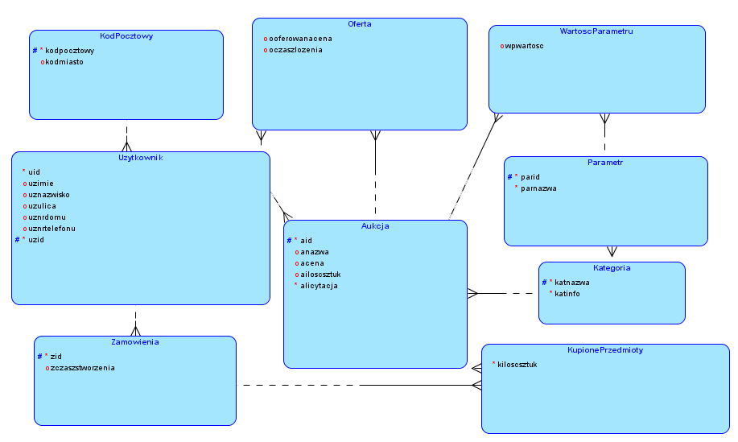
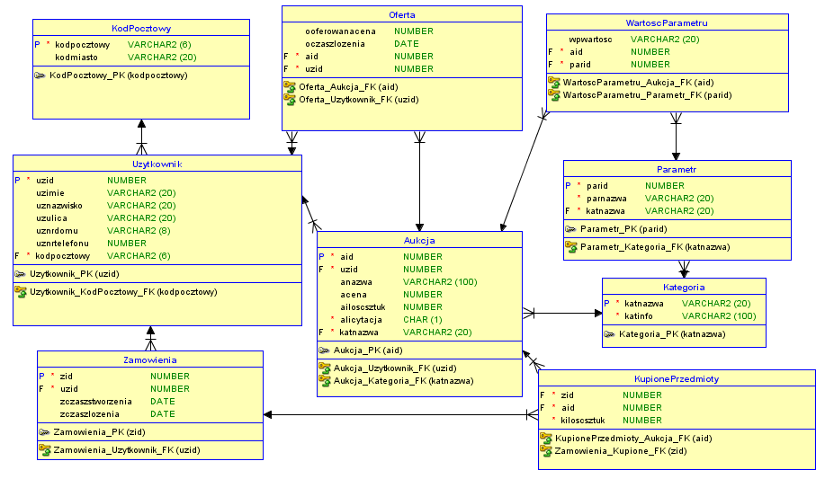

# Baza danych e-handel
Relacyjna baza danych służy do obsługi portalu internetowego do e-handlu.

Projekt został stworzony korzystając z oprgramowania SQL Developer Data Modeler 21.4.1.

## Założenia funkcjonalne:
- Użytkownik musi mieć przypisany jeden z kodów pocztowych znajdujących się w tabeli ‘KodPocztowy’.
- Każdy użytkownik może zarówno tworzyć aukcje, kupować przedmioty z aukcji oraz licytować na aukcjach.
- Użytkownik może sprzedawać wiele produktów, kupić wiele produktów, licytować wiele produktów, może też tworzyć wiele ofert kupna dla pojedynczej licytacji.
- Aby kupić produkt, należy pierwszy utworzyć zamówienia, a następnie dodawać do niego kupione przedmioty.
- W skład pojedynczego zamówienia może wchodzić wiele produktów, pochodzących od wielu sprzedawców (funkcja koszyka).
- Aukcja musi mieć przypisaną kategorię znajdującą się w tabeli ‘Kategoria’.
- Aby dodać przypisać aukcji parametr, wraz z jego wartość, nazwa parametru musi występować w tabeli ‘Parametr’.
- Każda aukcja może mieć przypisanych wiele parametrów.
- Każda kategoria może mieć przypisanych wiele parametrów.
- Parametry w poszczególnych kategoriach mogą mieć te same nazwy.
- Dodawanie rekordów do tabeli ‘KupionePrzedmioty’ automatycznie zmniejsza ilość sztuk dla odpowiedniej aukcji o ilość zakupionych sztuk (trigger).
- Aby przypisać klucz główny tabeli należy skorzystać skorzystać z odpowiedniej z wcześniej zdefiniowanych sekwencji.

## Schemat logiczny


## Schemat relacyjny


## Skrypty DDL SQL

## Tabele

### Aukcja:
```
-- Generated by Oracle SQL Developer Data Modeler 21.4.1.349.1605
--   at:        2022-01-17 16:28:50 CET
--   site:      Oracle Database 11g
--   type:      Oracle Database 11g


-- predefined type, no DDL - MDSYS.SDO_GEOMETRY

-- predefined type, no DDL - XMLTYPE

CREATE TABLE aukcja (
    aid         NUMBER NOT NULL,
    uzid        NUMBER NOT NULL,
    anazwa      VARCHAR2(100),
    acena       NUMBER,
    ailoscsztuk NUMBER,
    alicytacja  CHAR(1) NOT NULL,
    katnazwa    VARCHAR2(20) NOT NULL
);

ALTER TABLE aukcja ADD CONSTRAINT aukcja_pk PRIMARY KEY ( aid );
```

### Kategoria:
```
CREATE TABLE kategoria (
    katnazwa VARCHAR2(20) NOT NULL,
    katinfo  VARCHAR2(100) NOT NULL
);

ALTER TABLE kategoria ADD CONSTRAINT kategoria_pk PRIMARY KEY ( katnazwa );
```

### Kod Pocztowy:
```
CREATE TABLE kodpocztowy (
    kodpocztowy VARCHAR2(6) NOT NULL,
    kodmiasto   VARCHAR2(20)
);
ALTER TABLE kodpocztowy ADD CONSTRAINT kodpocztowy_pk PRIMARY KEY ( kodpocztowy );

CREATE TABLE kupioneprzedmioty (
    zid         NUMBER NOT NULL,
    aid         NUMBER NOT NULL,
    kiloscsztuk NUMBER NOT NULL
);
```

### Oferta:
```
CREATE TABLE oferta (
    ooferowanacena NUMBER,
    oczaszlozenia  DATE,
    aid            NUMBER NOT NULL,
    uzid           NUMBER NOT NULL
);
```

### Parametr:
```
CREATE TABLE parametr (
    parid    NUMBER NOT NULL,
    parnazwa VARCHAR2(20) NOT NULL,
    katnazwa VARCHAR2(20) NOT NULL
);

ALTER TABLE parametr ADD CONSTRAINT parametr_pk PRIMARY KEY ( parid );
```

### Użytkownik:
```
CREATE TABLE uzytkownik (
    uzid         NUMBER NOT NULL,
    uzimie       VARCHAR2(20),
    uznazwisko   VARCHAR2(20),
    uzulica      VARCHAR2(20),
    uznrdomu     VARCHAR2(8),
    uznrtelefonu NUMBER,
    kodpocztowy  VARCHAR2(6) NOT NULL
);

ALTER TABLE uzytkownik ADD CONSTRAINT uzytkownik_pk PRIMARY KEY ( uzid );
```

### Wartość Parametru:
```
CREATE TABLE wartoscparametru (
    wpwartosc VARCHAR2(20),
    aid       NUMBER NOT NULL,
    parid     NUMBER NOT NULL
);
```

### Zamówienia:
```
CREATE TABLE zamowienia (
    zid           NUMBER NOT NULL,
    uzid          NUMBER NOT NULL,
    zczaszlozenia DATE,
    zczasstworzenia DATE
);

ALTER TABLE zamowienia ADD CONSTRAINT zamowienia_pk PRIMARY KEY ( zid );
```

### Relacje:
```
ALTER TABLE aukcja
    ADD CONSTRAINT aukcja_kategoria_fk FOREIGN KEY ( katnazwa )
        REFERENCES kategoria ( katnazwa );

ALTER TABLE aukcja
    ADD CONSTRAINT aukcja_uzytkownik_fk FOREIGN KEY ( uzid )
        REFERENCES uzytkownik ( uzid );

ALTER TABLE kupioneprzedmioty
    ADD CONSTRAINT kupioneprzedmioty_aukcja_fk FOREIGN KEY ( aid )
        REFERENCES aukcja ( aid );

ALTER TABLE oferta
    ADD CONSTRAINT oferta_aukcja_fk FOREIGN KEY ( aid )
        REFERENCES aukcja ( aid );

ALTER TABLE oferta
    ADD CONSTRAINT oferta_uzytkownik_fk FOREIGN KEY ( uzid )
        REFERENCES uzytkownik ( uzid );

ALTER TABLE parametr
    ADD CONSTRAINT parametr_kategoria_fk FOREIGN KEY ( katnazwa )
        REFERENCES kategoria ( katnazwa );

ALTER TABLE uzytkownik
    ADD CONSTRAINT uzytkownik_kodpocztowy_fk FOREIGN KEY ( kodpocztowy )
        REFERENCES kodpocztowy ( kodpocztowy );

ALTER TABLE wartoscparametru
    ADD CONSTRAINT wartoscparametru_aukcja_fk FOREIGN KEY ( aid )
        REFERENCES aukcja ( aid );

ALTER TABLE wartoscparametru
    ADD CONSTRAINT wartoscparametru_parametr_fk FOREIGN KEY ( parid )
        REFERENCES parametr ( parid );

ALTER TABLE kupioneprzedmioty
    ADD CONSTRAINT zamowienia_kupione_fk FOREIGN KEY ( zid )
        REFERENCES zamowienia ( zid );

ALTER TABLE zamowienia
    ADD CONSTRAINT zamowienia_uzytkownik_fk FOREIGN KEY ( uzid )
        REFERENCES uzytkownik ( uzid );
```

### Sekwencje
Poniższe sekwencję służą do generowania kluczy głównych dla poszczególnych tabel.
```
CREATE SEQUENCE SUZID INCREMENT BY 1 MAXVALUE 9999999999999999999999999999 MINVALUE 1;

CREATE SEQUENCE SZID INCREMENT BY 1 MAXVALUE 9999999999999999999999999999 MINVALUE 1;

CREATE SEQUENCE SAID INCREMENT BY 1 MAXVALUE 9999999999999999999999999999 MINVALUE 1;

CREATE SEQUENCE SPARID INCREMENT BY 1 MAXVALUE 9999999999999999999999999999 MINVALUE 1;
```

### Wyzwalacze
Poniższy wyzwalacz automatycznie zmniejsza ilość sztuk dla odpowiedniej aukcji, gdy dodany zostanie rekord do tabeli ‘KupionePrzedmioty’.
```
CREATE OR REPLACE TRIGGER AKUALIZACJA_SZTUK 
AFTER INSERT ON KUPIONEPRZEDMIOTY 
REFERENCING OLD AS OLD NEW AS NEW
FOR EACH ROW
BEGIN
    update aukcja
    set ailoscsztuk = (select ailoscsztuk from aukcja where aid=:NEW.aid) - :NEW.kiloscsztuk
    where aid = :NEW.aid;
    
END;
/
```

## Wypełnienie tabel przykładowymi danymi


